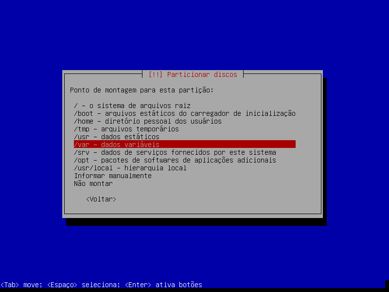
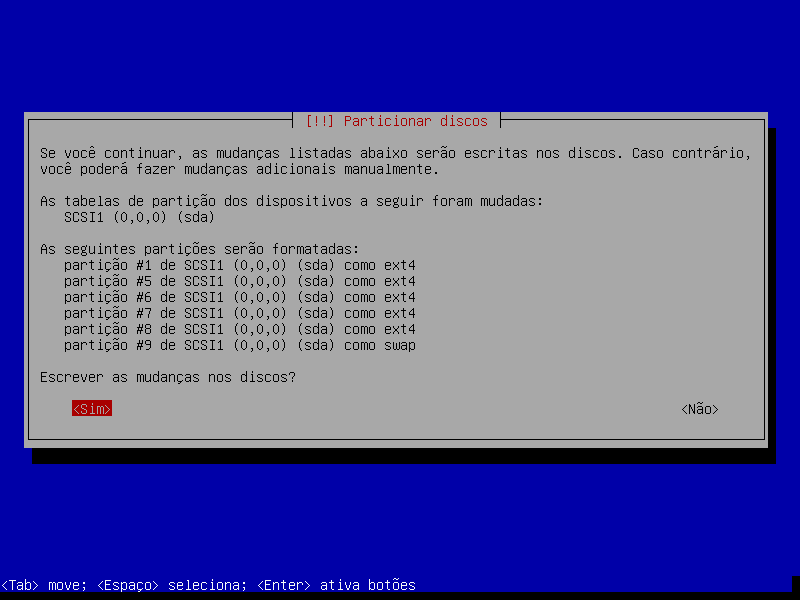
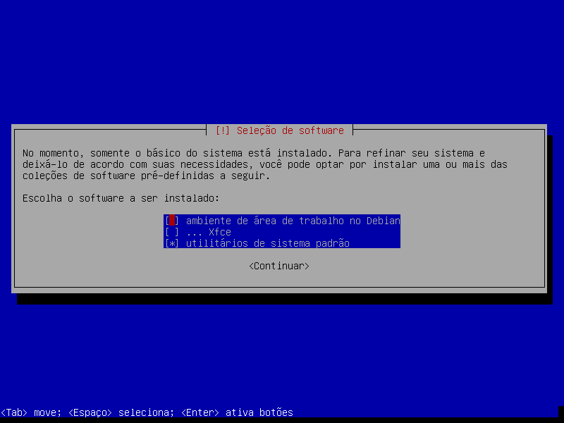
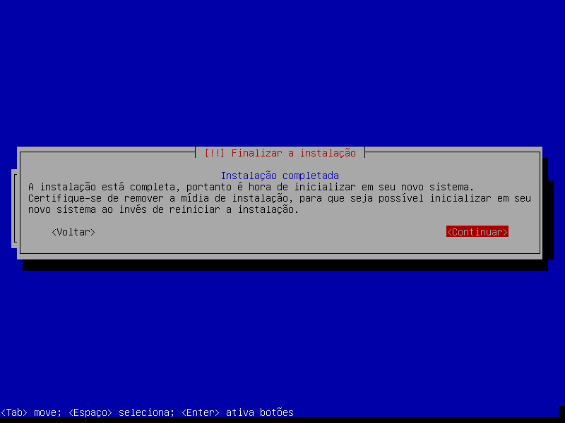
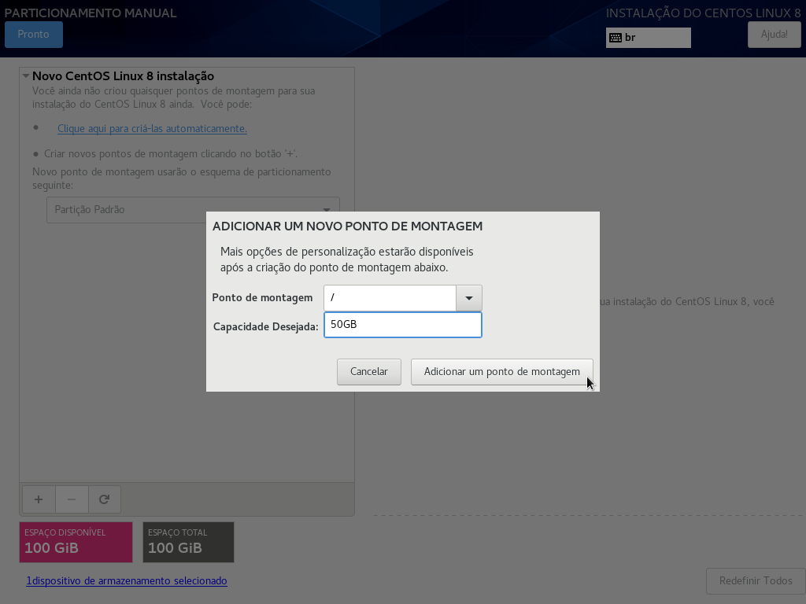
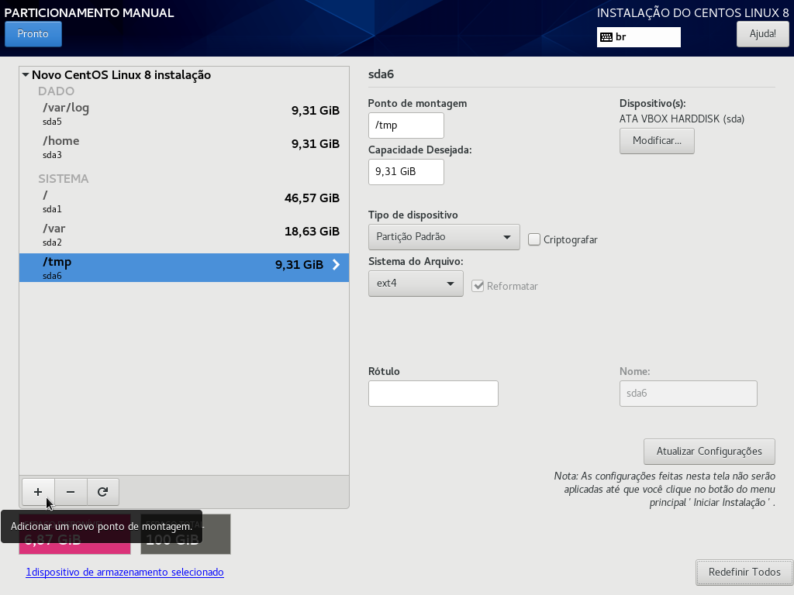

# Instalação do Linux

O uso do sistema Linux tem se expandido cada vez mais em computadores dosmésticos, chegando a registrar uma participação de 3,61% nos computadores do mundo, de acordo com dados da **NetMarketShare**. 

Pode parecer uma porcentagem pequena, mas corresponde a um recorde histórico dos sistemas operacionais de código aberto, além de refletir uma clara ascensão, já que o percentual anterior era de 3,17%.

Os usuários que cogitam trocar de sistema operacional e adotar a distribuição linux podem acabar com dúvidas recorrentes sobre quão seguro ele é, o que são termos como **Gnome** ou **KDE**, se há suporte para jogos ou qual o nível de oferta de aplicativos para o sistema, por exemplo.

Pensando nisso, nós, a **4Linux**, preparamos este guia com todos os detalhes para você ter seu Linux instalado.

Instalar o Linux há alguns anos era uma tarefa considerada desafiadora. Atualmente, é um processo bem mais simples, embora exija atenção a alguns detalhes inportantes, sobretudo em relação ao particionamento de disco. Importante ressaltar que não há um roteiro de instalação do Linux que serve para todos os casos de uso, mas podemos ficar atentos a algumas boas práticas, a saber:

* Isolar diretórios que têm gravação constante e vários usuários utilizam, como, por exemplo: **home**, **tmp** etc., a fim de não faltar espaço em disco para o sistema operacional;
* Isolar o diretório **home**, pois facilita o backup e restauração do sistema operacional após uma formatação e aplicação de cotas de disco;
* Isolar o diretório **tmp**, porque permite aplicar estratégias de segurança, como desabilitar execução de scripts maliciosos nesta pasta. Essa prática é relevante já que todo usuário pode executar scripts neste diretório;
* Isolar o diretório **/var/log** em uma partição, a fim de garantir que ele sempre terá um espaço mínimo para gravar registros de sistemas e de aplicações.


## Introdução

Agora que você está familiarizado com algumas noções básicas, hora de ir à prática. Em primeiro lugar, faça o download do Debian **GNU/Linux 10 Buster** (lançado em 06 de julho de 2019) no seguinte site: http://cdimage.debian.org/debian-cd/

Estes são os Exemplos de configuração do **CentOS 8.x** compatíveis com o **Red Hat Enterprise Linux 8.x**. O **CentOS 8** foi lançado em 24 de setembro de 2019 e será suportado até maio de 2029. Faça o download do arquivo ISO do **CentOS 8.1** para instalação no site a seguir: https://mirrors.oit.uci.edu/centos/8.1.1911/isos/x86_64/


## Esquema de particionamento de disco

* **Tamanho do disco para máquina virtual**: 100 GB
* **Quantidade de partições**: 6

&nbsp;

**Partição** | **Tamanho** | **Sistema de Arquivo** | **Ponto de Montagem**
-------------|-------------|------------------------|----------------------
/dev/sda1    |  50GB       |  ext4                  |       /
/dev/sda5    |  20GB       |  ext4                  |       /var
/dev/sda6    |  10GB       |  ext4                  |       /home
/dev/sda7    |  5GB        |  ext4                  |       /var/log
/dev/sda8    |  2,5GB      |  ext4                  |       /tmp
/dev/sda9    |  2,5GB      |  swap                  |


## Swap

Uma partição **swap** é usada para suportar a memória virtual. Em outras palavras, a partição **swap** é utilizada quando não há memória RAM suficiente para armazenar os dados que seu sistema está processando.

Nos últimos anos, a quantia recomendada de espaço swap aumentou de forma proporcional à memória RAM no sistema. No entanto, como a quantidade de memória aumentou em centenas de gigabytes, ficou estabelecido que a quantidade de espaço swap necessária depende da carga de trabalho da memória executada em um dado sistema.

O espaço **swap** geralmente é designado durante a instalação, mas determinar a carga de trabalho desta memória neste ponto pode ser difícil. 

Durante a instalação, você pode definir a quantia de **swap** conforme a tabela abaixo, que consideram a quantidade de memória RAM que você possui. 


Quantia de RAM no Sistema |	Quantia Recomendada de Espaço de Swap
--------------------------|--------------------------------------
4GB de RAM ou menos |	um mínimo de 2GB de espaço de swap
4GB até 16GB de RAM |	um mínimo de 4GB de espaço de swap
16GB até 64GB de RAM |	um mínimo de 8GB de espaço swap
64GB até 256GB de RAM |	um mínimo de 16GB de espaço swap.
256GB até 512GB de RAM |	um mínimo de 32GB de espaço swap 

&nbsp;

### Instalação do Debian 10














#### Procedimentos comuns pós instalação

Se você acabou de instalar o Sistema Operacional, siga os passos a seguir para melhor experiência de uso e comodidade.


* **Configurações iniciais:** Atualizar sistema

Mesmo que tenha instalado o sistema logo após seu lançamento, é interessante verificar se existem novas atualizações disponíveis.

Para isso, temos, no Debian, o APT. O APT controla o que é instalado no seu sistema.

O principal arquivo de configuração que o APT usa pra decidir de quais fontes ele deve baixar pacotes é `/etc/apt/sources.list`. Além disso, pode usar arquivos do diretório `/etc/apt/sources.list.d/` - para detalhes, veja: https://manpages.debian.org/buster/apt/sources.list.5.en.html

Aqui vai um exemplo do arquivo de repositórios do Debian:

```shell

deb http://deb.debian.org/debian buster main contrib non-free
deb-src http://deb.debian.org/debian buster main contrib non-free

deb http://deb.debian.org/debian-security/ buster/updates main contrib non-free
deb-src http://deb.debian.org/debian-security/ buster/updates main contrib non-free

deb http://deb.debian.org/debian buster-updates main contrib non-free
deb-src http://deb.debian.org/debian buster-updates main contrib non-free
```

```shell
root@localhost:~# apt update

Hit:1 http://deb.debian.org/debian buster InRelease
Get:2 http://deb.debian.org/debian buster-updates InRelease [46.8 kB]
Get:3 http://security.debian.org/debian-security buster/updates InRelease [39.1 kB]
Get:4 http://security.debian.org/debian-security buster/updates/main Sources [1,984 B]
Get:5 http://security.debian.org/debian-security buster/updates/main amd64 Packages [1,864 B]
Get:6 http://security.debian.org/debian-security buster/updates/main Translation-en [1,660 B]
Fetched 91.4 kB in 3s (33.2 kB/s)
Reading package lists... Done
Building dependency tree
Reading state information... Done
All packages are up to date.
```

```shell
root@localhost:~# apt upgrade  -y
```

* **Configurações iniciais:** Configurações do Vim


Toda distribuição Linux já vem com o `vi` instalado, entretanto o vim (vi improved) é hoje, sem dúvida, o melhor editor de arquivos pra quem trabalha diariamente com Linux. Sendo assim, recomendamos instalá-lo nos servidores que você costuma trabalhar. Para instalar o vim em distribuições variadas de Debian basta rodar o comando abaixo com direitos de root.

* Instale o Vim:

```shell
[root@localhost ~]# apt install vim -y
```

Além disso, vale configurar o vim para que destaque os arquivos enquanto estiver editando. Para tanto, edite o arquivo vimrc que está dentro da pasta /etc/vim, conforme os comandos abaixo.

```shell
 [root@localhost ~]# vi ~/.vimrc

set number                    " Numera as linhas
set linebreak                 " Quebra a linha sem quebrar a palavra
set nobackup                  " Não salva arquivos de backup~
set wildmode=longest,list     " Completa o comando com TAB igual o bash
set ignorecase                " Ignora o case sensitive nas buscas
set smartcase                 " Se tiver alguma letra maiúscula, ativa o case sensitive
set gdefault                  " Sempre substitui todas as palavras, não só a primeira
set smartindent               " Auto-indenta
set expandtab                 " Identa com espaços
set tabstop=2                 " Quantidade de espaços por indentação
set shiftwidth=2              " Quantidade de espaços da auto-indentação
set guioptions-=T             " Deixa a GUI sem a toolbar
set autochdir                 " Vai pro diretório do arquivo aberto
set cursorline                " Mostra linha atual mais clara
set hlsearch                  " Termo procurado em destaque
set pumheight=15              " Máximo de palavras no popup de autocomplete
set completeopt=menu,preview  " Como mostrar as possibilidade de inserção
set spelllang=pt              " Escolhe o dicionário
set foldenable                " Habilita agrupamento de blocos
set foldcolumn=1              " Exibie coluna com + e - para agrupamentos
set foldmethod=marker         " Define agrupamento por marcas
set foldmarker={,}            " Define marcas de agrupamento como { e }
set foldlevel=9999            " Inicia com todos os agrupamentos abertos
```

```shell
[root@localhost ~]# source ~/.bashrc 
```

### Instalação do CentOS 8








#### Procedimentos comuns pós instalação

Segurança é um fator fundamental para o gerenciamento de servidores. Porém, muitas vezes, deixamos esse aspecto de lado, principalmente em projetos pequenos ou pessoais. Entrando nesse tópico, já adiantamos a você que às vezes é necessário desabilitar o firewall no Centos 7. 

No caso das distribuições Linux, muitas já possuem fortes políticas de segurança. A exemplo do CentOS e o RHEL, opções seguras dentro do Linux devido à proteção multinível do SELinux. Entretanto, ter muitas medidas de segurança pode atrapalhar algumas tarefas rotineiras. E, portanto, pode ser necessário desabilitar algumas delas.

* **Firewall**

Um firewall faz o filtro de pacotes que passam na rede. Para configurar um firewall, é necessário ter conhecimento sobre a estrutura da rede em questão e dos diferentes protocolos envolvidos na comunicação, Ou seja, dos serviços que a rede usa para que eles não percam a comunicação. O objetivo de ter uma máquina fazendo o papel de Firewall Gateway em nossa rede é minimizar as tentativas de ataques, tentando impedir possíveis invasões e roubo de informações.

É possível mostrar o status do serviço FireWall da seguinte maneira. (ativado por padrão)

```shell
[root@localhost ~]# systemctl status firewalld

*  firewalld.service - firewalld - dynamic firewall daemon
   Loaded: loaded (/usr/lib/systemd/system/firewalld.service; enabled; vendor p>
   Active: active (running) since Wed 2019-09-24 23:16:35 JST; 18min ago
     Docs: man:firewalld(1)
 Main PID: 801 (firewalld)
    Tasks: 2 (limit: 25025)
   Memory: 30.9M
   CGroup: /system.slice/firewalld.service
           └─801 /usr/libexec/platform-python -s /usr/sbin/firewalld --nofork ->

Sep 24 23:16:34 localhost.localdomain systemd[1]: Starting firewalld - dynamic >
Sep 24 23:16:35 localhost.localdomain systemd[1]: Started firewalld - dynamic f>

 # [Active: active (running) ***] means firewalld is running now
```

Se você não precisar do serviço FireWall por qualquer que seja o motivo - como o fato de algumas máquinas FireWall estarem sendo executadas na rede local ou outras -, é possível desativá-lo no servidor CentOS da seguinte forma:

stop service

```shell
[root@localhost ~]# systemctl stop firewalld
```

disable service

```shell
[root@localhost ~]# systemctl disable firewalld

Removed /etc/systemd/system/multi-user.target.wants/firewalld.service.
Removed /etc/systemd/system/dbus-org.fedoraproject.FirewallD1.service. 
```

* **SELinux**

O SELinux é uma ferramenta de segurança que restringe o acesso a módulos específicos do Kernel. Algumas distribuições Linux, como CentOS e RHEL, já têm o firewall por padrão como uma medida de segurança extra no sistema. Outras distribuições, como Debian, também permitem sua instalação.

O SELinux é gerenciado através de algumas regras chamadas “políticas”, que restringem ou permitem o uso de certas aplicações para partes essenciais do sistema. O problema é que criar essas políticas pode ser muito difícil.

A ferramenta atualmente possui três modos:

* O modo Enforcing nega todos os acessos não autorizados. Neste modo, o SELinux é considerado como habilitado.
* No modo Permissive, diferente do modo anterior, é permitido o acesso não autorizado, mas com a exibição de avisos.
* Em modo Disable o SELinux está desabilitado e permite todos os acessos sem avisos.


É possível desabilitar o SELinux temporária ou permanentemente, cada um com seus benefícios. Desabilitar temporariamente permite realizar testes sem precisar sacrificar a segurança. Assim que o sistema é reiniciado, o SELinux é ativado novamente.

Por outro lado, desativar o firewall permanentemente torna possível trabalhar mais rápido, principalmente em projetos pequenos ou médios. É importante lembrar que, atualmente, as distribuições do Linux possuem ótimas políticas de segurança, então desativar o SELinux não é tão prejudicial.

É possível mostrar o status atual do SELinux (Security-Enhanced Linux) da seguinte maneira (ativado por padrão):

```shell
[root@localhost ~]# getenforce
Enforcing     # SELinux is enabled
```

Se você ativar o SELinux, há casos em que precisará modificar a política do SELinux manualmente, porque algumas vezes o SELinux interrompe os aplicativos. Se você não precisar do recurso SELinux por qualquer motivo, como o servidor estar executando apenas na Rede de segurança local ou outros, é possível desativar da seguinte forma:

```shell
 [root@localhost ~]# vim /etc/selinux/config

 # This file controls the state of SELinux on the system.
 # SELINUX= can take one of these three values:
 #     enforcing - SELinux security policy is enforced.
 #     permissive - SELinux prints warnings instead of enforcing.
 #     disabled - No SELinux policy is loaded.
 # change the value below
 # enforcing  ⇒ enabled
 # disabled   ⇒ disabled
 # permissive ⇒ enabled but only loging, not deny accesses
 SELINUX=disabled
 # SELINUXTYPE= can take one of these two values:
 #     targeted - Targeted processes are protected,
 #     minimum - Modification of targeted policy. Only selected processes are protected.
 #     mls - Multi Level Security protection.
 SELINUXTYPE=targeted

 # restart computer to apply setting

[root@localhost ~]# reboot
```

* Configurações iniciais: Atualizar sistema

A ferramenta de gerenciamento de pacotes DNF (Dandified YUM) foi definida como padrão no RHEL 8 / CentOS 8.

No entanto, o comando [yum] também está localizado como um link para o [dnf], portanto, é possível usar [yum] ou [dnf] com a mesma finalidade. Na verdade, os documentos oficiais no RedHat dão exemplos com o comando [yum] para o RHEL 8.
(os documentos neste site dão exemplos com o comando [dnf])

[yum] e [dnf] estão vinculados ao comando [dnf-3].

```shell
[root@localhost ~]# which yum

/usr/bin/yum
```

```shell
[root@localhost ~]# ll yum

ls: não foi possível acessar 'yum': Arquivo ou diretório inexistente
```

```shell
[root@localhost ~]# ll /usr/bin/yum

lrwxrwxrwx. 1 root root 5 dez 19 12:43 /usr/bin/yum -> dnf-3
```

```shell
[root@localhost ~]# rpm -q yum

yum-4.2.7-7.el8_1.noarch
```

```shell
[root@localhost ~]# clear
```

```shell
[root@localhost ~]# which yum

/usr/bin/yum
```

```shell
[root@localhost ~]# ll /usr/bin/yum

lrwxrwxrwx. 1 root root 5 dez 19 12:43 /usr/bin/yum -> dnf-3
```

```shell
[root@localhost ~]# which dnf

/usr/bin/dnf
```

```shell
[root@localhost ~]# ll /usr/bin/dnf

lrwxrwxrwx. 1 root root 5 dez 19 12:43 /usr/bin/dnf -> dnf-3
```

```shell
[root@localhost ~]# ll /usr/bin/dnf-3 

-rwxr-xr-x. 1 root root 1954 dez 19 12:43 /usr/bin/dnf-3
```

```shell
[root@localhost ~]# rpm -q yum

yum-4.2.7-7.el8_1.noarch
```

```shell
[root@localhost ~]# rpm -ql yum

/etc/dnf/protected.d/yum.conf
/etc/yum.conf
/etc/yum/pluginconf.d
/etc/yum/protected.d
/etc/yum/vars
/usr/bin/yum
/usr/share/man/man1/yum-aliases.1.gz
/usr/share/man/man5/yum.conf.5.gz
/usr/share/man/man8/yum-shell.8.gz
/usr/share/man/man8/yum.8.gz
```

```shell
[root@localhost ~]# ll /etc/yum.conf

lrwxrwxrwx. 1 root root 12 dez 19 12:43 /etc/yum.conf -> dnf/dnf.conf
```

```shell
[root@localhost ~]# ll /etc/yum/vars

lrwxrwxrwx. 1 root root 11 dez 19 12:43 /etc/yum/vars -> dnf/vars
```

Após a instalação, atualize o CentOS Server para o mais recente:

```shell
[root@localhost ~]# dnf -y upgrade 

CentOS-8 - AppStream                                      4.7 kB/s | 4.3 kB     00:00    
CentOS-8 - Base                                           4.4 kB/s | 3.9 kB     00:00    
CentOS-8 - Extras                                         546  B/s | 1.5 kB     00:02    
Dependências resolvidas.
Nada para fazer.
Concluído!
```

* Configurações iniciais: Configurações do Vim

Existem muitos casos para usar o editor de texto no terminal, por isso é mais conveniente instalar editor com recursos avançados como o Vim.

Instalar o Vim:

```shell
[root@localhost ~]# dnf -y install vim-enhanced 
```

Defina o **alias** de comando pro seu próprio ambiente:

```shell
[root@localhost ~]# vi ~/.bashrc

# add alias to the end

alias vi='vim'
# apply changes
```

Configure o Vim para seu próprio ambiente. (configurações comuns para todos os usuários estão em [/etc/vimrc])

```shell
 [root@localhost ~]# vi ~/.vimrc

set number                    " Numera as linhas
set linebreak                 " Quebra a linha sem quebrar a palavra
set nobackup                  " Não salva arquivos de backup~
set wildmode=longest,list     " Completa o comando com TAB igual o bash
set ignorecase                " Ignora o case sensitive nas buscas
set smartcase                 " Se tiver alguma letra maiúscula, ativa o case sensitive
set gdefault                  " Sempre substitui todas as palavras, não só a primeira
set smartindent               " Auto-indenta
set expandtab                 " Identa com espaços
set tabstop=2                 " Quantidade de espaços por indentação
set shiftwidth=2              " Quantidade de espaços da auto-indentação
set guioptions-=T             " Deixa a GUI sem a toolbar
set autochdir                 " Vai pro diretório do arquivo aberto
set cursorline                " Mostra linha atual mais clara
set hlsearch                  " Termo procurado em destaque
set pumheight=15              " Máximo de palavras no popup de autocomplete
set completeopt=menu,preview  " Como mostrar as possibilidade de inserção
set spelllang=pt              " Escolhe o dicionário
set foldenable                " Habilita agrupamento de blocos
set foldcolumn=1              " Exibie coluna com + e - para agrupamentos
set foldmethod=marker         " Define agrupamento por marcas
set foldmarker={,}            " Define marcas de agrupamento como { e }
set foldlevel=9999            " Inicia com todos os agrupamentos abertos
```

```shell
[root@localhost ~]# source ~/.bashrc 
```


